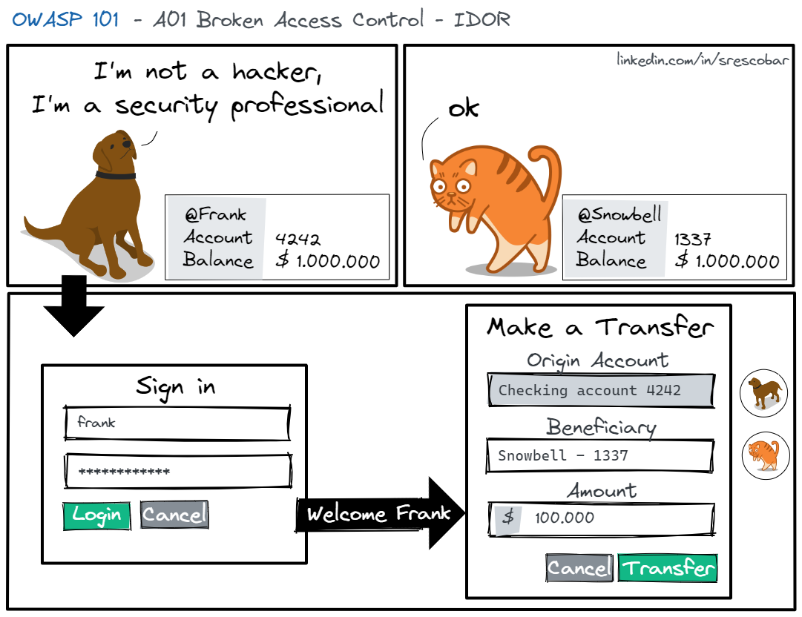
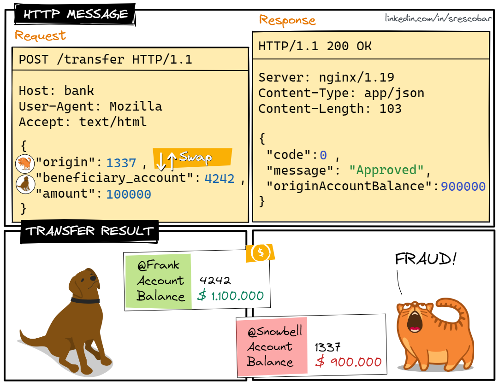
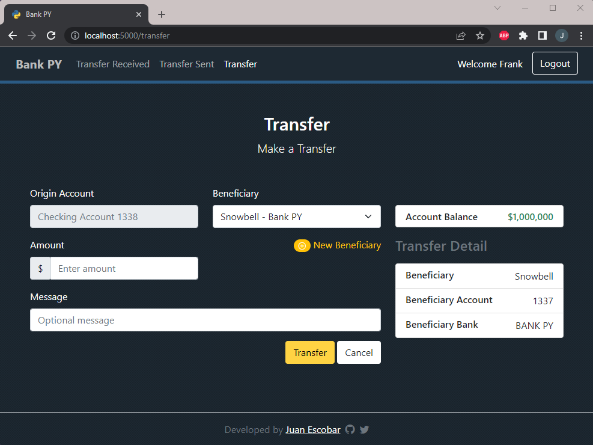
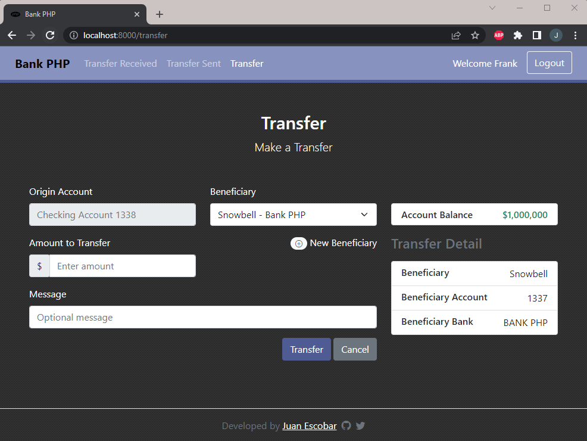

# OWASP 101 - Bank App

## Table of Contents
- [OWASP 101 - Bank App](#owasp-101---bank-app)
  - [Table of Contents](#table-of-contents)
  - [IDOR](#idor)
  - [What is a unique identifier?](#-what-is-a-unique-identifier)
  - [How to detect it?](#-how-to-detect-it)
  - [How to fix it?](#-how-to-fix-it)
    - [Code Example](#code-example)
      - [PHP](#php)
      - [Python](#python)
  - [Hands-on](#-hands-on)
    - [Bank PY](#bank-py)
    - [Bank PHP](#bank-php)
  - [Credits](#credits)

## IDOR
Insecure Direct Object References (IDOR) is an access control vulnerability that allows an attacker to manipulate another user's account through a unique identifier.

## ❓ What is a unique identifier?
A unique identifier is a piece of data that is associated with a user and can be:

* An incremental numeric value.
* The national identity card (NID) number.
* The email address.
* The telephone number.
* Bank account number, etc.

## 🔎 How to detect it?
Let's take a look at an example of a real-life exploitation in a banking application.




## 🩹 How to fix it?
Verify that the identifier you are accessing belongs to the user who is logged into the application.

### Code Example
#### PHP
``` php
// Check that origin account belongs to the current user.
if ($tef->origin != Auth::user()->product->id) {
    return [
        'code' => '0001',
        'message' => 'Possible bank fraud. Your IP address has been logged.',
    ];
}
```

#### Python
``` python
# Check that origin account belongs to the current user.
if data["origin"] != request.user.products.get().number:
    return JsonResponse({
        "code": "0001",
        "message": "You don't have permission to perform this operation.",
    })
``` 

## 🚀 Hands-on
Let's try to hack it 💀
1. Download the distribution code from https://github.com/itsecurityco/OWASP-101/archive/refs/heads/A01.zip and unzip it.
2. Run `docker compose up db -d` and and **wait until it's over** to build and populate the database.
3. Run `docker compose up python -d` to build and start the vulnerable **Python** application.
4. Run `docker compose up php -d` to build and start the vulnerable **PHP** application.
5. Open your browser and go to http://localhost:5000/ to start hacking the **Bank PY**.
6. Open your browser and go to http://localhost:8000/ to start hacking the **Bank PHP**.

### Bank PY


### Bank PHP


---

## Credits
Developed by [@itsecurityco](https://github.com/itsecurityco)
